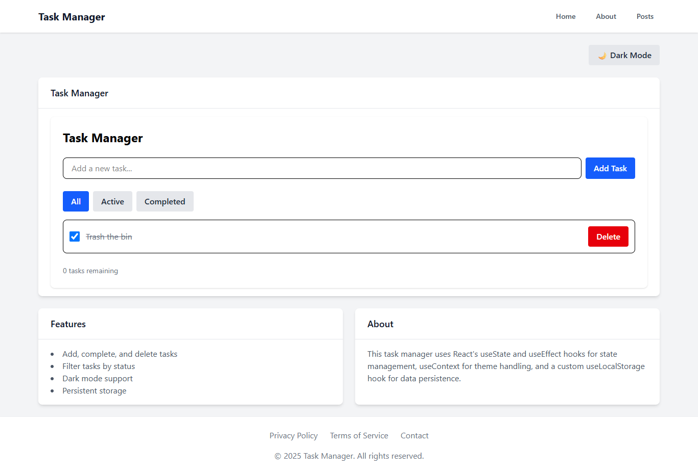

# Task Manager (React + Vite + Tailwind + React Router)

## � Live Demo

**Deployed URL:** [https://plp-mern-stack-development.github.io/react-js-jsx-and-css-mastering-front-end-development-Princessglory/](https://plp-mern-stack-development.github.io/react-js-jsx-and-css-mastering-front-end-development-Princessglory/)

## �🖼️ Screenshot

Below is a screenshot of the Task Master app front page:



A learning project that implements a task manager with reusable components, routing, theme switching (light/dark), state management with hooks, and API integration (JSONPlaceholder) including search, loading/error states, and infinite scrolling.

## ✅ Tech Stack
- React 19 + Vite 7
- Tailwind CSS 4 (class-based dark mode)
- React Router
- ESLint (recommended rules)

## 🚀 Quick Start (Windows PowerShell)

```powershell
# 1) Go to the project folder
cd "c:\Users\USER\OneDrive\Desktop\MERN\week-3-React\react-js-jsx-and-css-mastering-front-end-development-Princessglory\react-task-master"

# 2) Install dependencies
npm install

# 3) Start the dev server
npm run dev
```

Vite will print a Local URL (e.g., http://localhost:5173 or 5174/5175 if the port is busy). Open it in your browser.

If the browser says "localhost refused to connect":
- Ensure the Vite process is running and hasn’t exited.
- Stop any previous Vite servers (Ctrl + C in their terminals).
- Start again with `npm run dev` from the project folder.

Optionally free old ports if they’re stuck:
```powershell
netstat -ano | findstr :5173
Stop-Process -Id <PID>
netstat -ano | findstr :5174
Stop-Process -Id <PID>
```

## 📦 Scripts
- `npm run dev` – Start Vite dev server with HMR
- `npm run build` – Create production build in `dist/`
- `npm run preview` – Preview the production build locally
- `npm run lint` – Run ESLint (optional, shown for reference)

## 🗂️ Project Structure
```
react-task-master/
├─ index.html
├─ package.json
├─ tailwind.config.js
├─ vite.config.js
├─ src/
│  ├─ main.jsx
│  ├─ index.css               # Tailwind entry (@import "tailwindcss")
│  ├─ App.css
│  ├─ App.jsx                 # Router + Layout wrapper
│  ├─ components/
│  │  ├─ Button.jsx
│  │  ├─ Card.jsx
│  │  ├─ Footer.jsx
│  │  ├─ Layout.jsx           # Adds a top-level dark class fallback
│  │  ├─ Navbar.jsx           # Includes a theme toggle button
│  │  ├─ Posts.jsx            # API grid with search + infinite scroll
│  │  └─ TaskManager.jsx      # Add/complete/delete/filter tasks
│  ├─ pages/
│  │  ├─ About.jsx
│  │  ├─ Home.jsx
│  │  └─ PostsPage.jsx
│  ├─ hooks/
│  │  ├─ useFetch.js          # Fetch + pagination + abort + refresh
│  │  ├─ useLocalStorage.js   # Persist values in localStorage
│  │  └─ useTheme.js          # Access theme context
│  └─ context/
│     ├─ ThemeContext.jsx     # Provider; toggles html.dark + persistence
│     └─ theme.js             # React context only
```

## 🎨 Tailwind CSS Setup
- Using Tailwind v4 with the simplest entry in `src/index.css`:
```css
@import "tailwindcss";
```
- Dark mode is class-based. `tailwind.config.js`:
```js
/** @type {import('tailwindcss').Config} */
export default {
  darkMode: 'class',
  content: ["./index.html", "./src/**/*.{js,ts,jsx,tsx}"],
  theme: { extend: {} },
  plugins: [],
};
```
- After changing `tailwind.config.js`, restart the dev server to ensure classes rebuild correctly.

## 🌓 Theme (Light/Dark Mode)
- `ThemeProvider` initializes from:
  - `localStorage` ("theme" = "dark" | "light")
  - or OS preference `(prefers-color-scheme: dark)` on first run
- It adds/removes the `dark` class on the `<html>` element and persists the choice.
- `Layout.jsx` additionally applies a scoped `dark` class to the app container as a fallback. This ensures dark styles render reliably during HMR.
- Toggle locations:
  - Navbar (right side): button labeled 🌙 Dark / 🌞 Light
  - Home page: may include a toggle button as well

Verification (in browser DevTools console):
```js
document.documentElement.classList.contains('dark') // true when dark mode is active
localStorage.getItem('theme') // "dark" or "light"
```

## 🧩 Reusable Components
- `Button` – Variants: primary | secondary | danger; hover/active transitions
- `Card` – Boxed layout with animated hover and optional title
- `Navbar` – Brand + links + theme toggle
- `Footer` – Links + dynamic copyright
- `Layout` – Common page shell, dark mode fallback scope

## ✅ Tasks Implemented
- Task 1: Vite app, Tailwind, routing, base structure
- Task 2: Component architecture (Button, Card, Navbar, Footer, Layout)
- Task 3: State + hooks (TaskManager, useState/useEffect/useContext, useLocalStorage)
- Task 4: API integration (JSONPlaceholder Posts with search, loading/error, infinite scroll)
- Task 5: Tailwind styling (responsive, dark mode, transitions)

## 🔍 API Integration (Posts)
- Data source: https://jsonplaceholder.typicode.com/posts
- Features:
  - Search by title (`title_like`)
  - Infinite scrolling via IntersectionObserver
  - Loading spinner + error handling + empty states

## 🧪 Troubleshooting
- "This site can’t be reached / refused to connect"
  - Ensure Vite is running and the URL matches the printed port (5173, 5174, or 5175)
  - Stop all previous Vite processes (Ctrl+C), then run `npm run dev` again
- Dark mode doesn’t switch:
  - Restart the dev server after editing `tailwind.config.js`
  - Verify the `<html>` element gets the `dark` class
  - Check `localStorage.getItem('theme')`
- Missing file errors (e.g., `./App.css`, `/src/main.jsx`)
  - Ensure `src/main.jsx` exists and `index.html` references `/src/main.jsx`
  - Ensure `src/App.css` exists (an empty file is fine)

## 🏗️ Build & Preview
```powershell
npm run build
npm run preview
```
Vite will serve the production build locally for verification.

## � Deploy to GitHub Pages

### First-Time Setup:
1. **Push your code to GitHub** (if not already done):
```powershell
cd "c:\Users\USER\OneDrive\Desktop\MERN\week-3-React\react-js-jsx-and-css-mastering-front-end-development-Princessglory"
git add .
git commit -m "Ready for deployment"
git push origin main
```

2. **Deploy to GitHub Pages**:
```powershell
cd "c:\Users\USER\OneDrive\Desktop\MERN\week-3-React\react-js-jsx-and-css-mastering-front-end-development-Princessglory\react-task-master"
npm run deploy
```

3. **Enable GitHub Pages** (one-time setup):
   - Go to your GitHub repository
   - Click **Settings** → **Pages**
   - Under "Source", select **gh-pages** branch
   - Click **Save**

4. **Wait 1-2 minutes** for deployment to complete, then visit:
   - `https://plp-mern-stack-development.github.io/react-js-jsx-and-css-mastering-front-end-development-Princessglory/`

### Update Deployment (after making changes):
```powershell
cd "c:\Users\USER\OneDrive\Desktop\MERN\week-3-React\react-js-jsx-and-css-mastering-front-end-development-Princessglory\react-task-master"
npm run deploy
```

This automatically builds and pushes to the `gh-pages` branch.

## �📋 Notes
- Node.js 18+ recommended.
- When ports are busy, Vite automatically tries the next port.
- After changing Tailwind config, always restart the dev server.

---
If you get stuck, copy the terminal output or browser console error and I’ll help troubleshoot fast.
